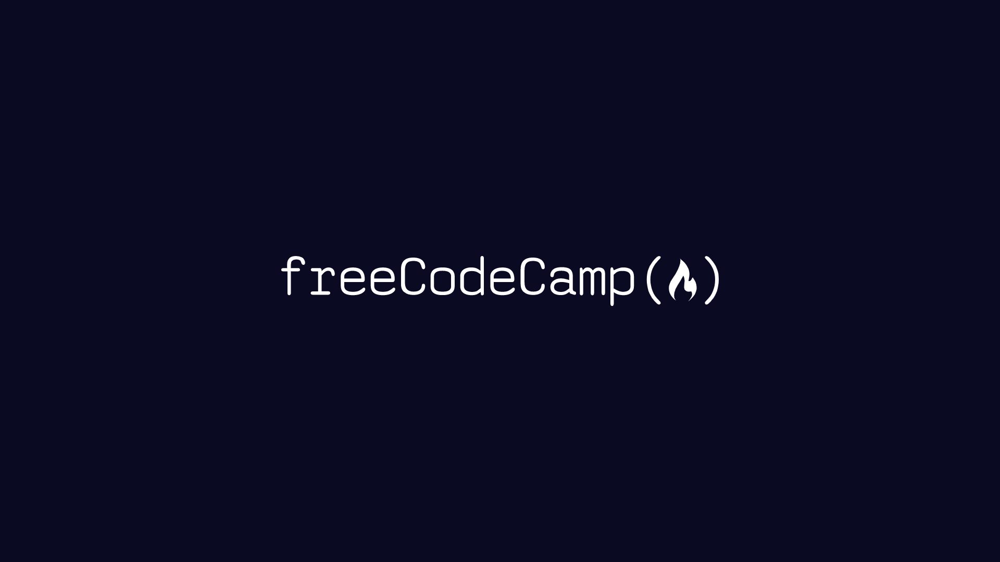

# 🧠 freeCodeCamp solutions

[**freeCodeCamp**](https://www.freecodecamp.org/learn) (also referred to as Free Code Camp) is a non-profit educational organization that consists of an interactive learning web platform, an online community forum, chat rooms, online publications and local organizations that intend to make learning software development & computer programming accessible to anyone.

---

## 📁 Table of Content
 
- 📂 [Responsive Web Design](#-responsive-web-design)

### 📂 Responsive Web Design

In this [**Responsive Web Design**](https://www.freecodecamp.org/learn/2022/responsive-web-design/) Certification, you'll learn the languages that developers use to build webpages: HTML (Hypertext Markup Language) for content, and CSS (Cascading Style Sheets) for design.

| Name | Description | Directory |
| ---- | ----------- | --------- |
| [**Learn HTML by Building a Cat Photo App**](https://www.freecodecamp.org/learn/2022/responsive-web-design/learn-html-by-building-a-cat-photo-app/step-1) | HTML tags give a webpage its structure. You can use HTML tags to add photos, buttons, and other elements to your webpage. | [Open](./resources/documents/01-responsive-web-design/01-learn-html-by-building-a-cat-photo-app/) |

You can see all the [Responsive Web Design solutions](./resources/documents/01-responsive-web-design/responsive-web-design.md) here.

---

🙏 **Thank you, freeCodeCamp**, for being an excellent and free platform for learning to code! The easy-to-understand curriculum and hands-on projects have immensely helped me develop my skills and confidence as a developer.